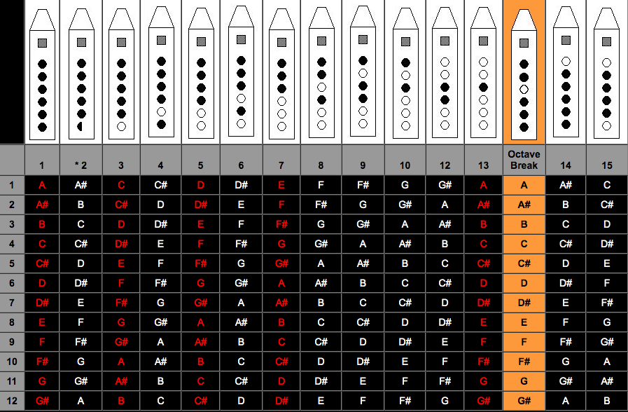

# WSS-2019

**Wolfram Summer School 2019 archive and an early public origin point for Wrfcoin**

This repository preserves the work I completed at Wolfram Summer School in 2019 in Waltham, Massachusetts.

In 2018 and 2019 I was traveling to technology conferences, including Cleantech Open, Web Summit in Lisbon, and Collision in Toronto, trying to get the Wrfcoin idea seen and taken seriously. At Collision 2019, Stephen Wolfram heard about the project and invited me to attend Wolfram Summer School. That invitation became a foundational moment in my professional development.

At the summer school, with help from mentors and other incredibly smart people, I built an early prototype that connected live weather-station data to a privately operated blockchain using Wolfram technologies. This repo captures the point where Wrfcoin stopped being only a pitch and became something real.

*One of the Wolfram Summer School 2019 group photos in Waltham. The technical work mattered, but so did the community around it: mentors, peers, and the shared feeling of building strange ambitious things together.*

## Technical summary

The final-project prototype was a small end-to-end weather-data pipeline built in the Wolfram ecosystem. In rough terms, the architecture was:

1. collect live weather-station data
2. analyze station density, proximity, and data structure in Wolfram notebooks
3. use Wolfram Cloud scheduling and notebook automation to prepare recurring updates
4. write structured weather records into a privately operated Wolfram-based blockchain

That is the technical bridge between "Wrfcoin as an idea" and "Wrfcoin as something that can ingest live environmental data on a recurring basis."

## What is in this repository

- [Final Project](./Final%20Project) contains the notebook `Automating Weather Data Storage on the Wolfram Blockchain - FinalProject.nb`, plus drafts and presentation materials. The project explores IoT connectivity, weather-station density, proximity to neighboring stations, data visualization, and cloud-deployed scheduled tasks.
- [Homework](./Homework) contains `Properties of a Native American Flute.nb`, a computational essay on flute geometry, acoustics, and automated dimension and hole-pattern design.
- [Contributions](./Contributions) preserves the original submission structure for extra notebooks and repository contributions from the program.
- [Wolfram Community Post](./Wolfram%20Community%20Post) holds materials related to the school's public write-up process.

*One artifact from the homework computational essay on Native American flute geometry: a key-pattern table mapping fingering combinations across the playable range. This notebook now has a direct engineering counterpart in the public [`flutes`](https://github.com/tonykoop/flutes) repository.*

## Why this repo matters in my portfolio

- It documents an early technical prototype in the Wrfcoin lineage.
- It shows the overlap between my physical-world engineering interests and computational systems thinking.
- It also reflects a theme that keeps showing up across my work: instruments, sensing, geometry, data, and engineering all informing each other.

## Cross-repo bridge — Native American flute geometry

The homework notebook `Properties of a Native American Flute.nb` is the clearest bridge from my Wolfram work to my instrument-engineering repos. It treats Native American flute geometry as a computational essay problem; [`flutes`](https://github.com/tonykoop/flutes) treats the same instrument family as a parametric design-table, build-registry, and shop-process problem. The two repos strengthen each other because they show the same engineering instinct expressed in two different mediums.

## Notes for visitors

- This repo intentionally preserves the original 2019 Wolfram Summer School folder structure, so some subfolder READMEs still read like class-template instructions.
- The top-level README is the main orientation page; the notebooks are the primary deliverables.
- This is best read as a historical project archive, not as an actively maintained software package.

## Related links

- [Wrfcoin](https://www.wrfcoin.com)
- [Flutes](https://github.com/tonykoop/flutes)
- [Tony Koop GitHub profile](https://github.com/tonykoop)

